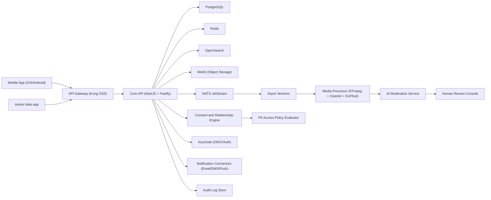

# Architecture

## Architecture Style

Use a `modular monolith first` with strict domain boundaries, then extract services when load, team size, or reliability goals require it.

Why:

- Faster MVP delivery than early microservices.
- Lower operational complexity.
- Clear path to scale without rewriting domain logic.

## High-Level System

## Domain Modules

- Identity and Access: login, tokens, RBAC, session management
- Profiles and Verification: provider profiles, KYC documents, trust score
- Service Catalog: categories, skills, pricing models
- Jobs and Matching: posting, search, shortlist, apply/accept
- Booking and Workflow: scheduling and status transitions
- Messaging and Notifications: chat and alerts
- Payments and Payouts: ledger interfaces and reconciliation hooks
- Ratings and Disputes: reviews, flags, and adjudication
- Content and Ads: CMS-like publishing for platform content
- Moderation and Safety: abuse detection, blocking, policy enforcement
- Media Management: upload, processing, secure download, and retention
- Media Review Workflow: AI scoring, human review, and publish gating
- Relationship Management: connection requests and mutual approval state
- PII Consent Management: owner-controlled grants, type-based sharing, revocation

## Data Ownership

- PostgreSQL: source of truth for transactions and relational data
- Redis: cache, rate-limits, short-lived sessions, queue support
- OpenSearch: full-text and geo queries for discovery
- MinIO: media and verification documents with separate `quarantine` and `approved` buckets
- Audit Log Store: immutable security and compliance events
- PII fields in PostgreSQL with encryption-at-rest and access-event logging
- Internal Event Outbox: protobuf payload storage for async publication to JetStream

## Security Architecture

- OIDC/OAuth2 via Keycloak
- MFA required for admin and support roles
- Optional MFA for providers and seekers
- Passkey/WebAuthn support for stronger authentication
- End-to-end TLS (`TLS 1.3`) for all edge and service traffic
- Secret encryption using `SOPS + age` in GitOps workflows
- Row-level authorization checks at service layer
- Signed URL access for private files in object storage
- Tamper-evident audit trail for auth, payout, and moderation events
- Mandatory malware scanning for all uploaded files before any review step
- EXIF/metadata stripping before public delivery
- Public media serving allowed only from `approved` bucket objects
- PII response filtering via consent policy evaluator on every read endpoint
- Revocation event fanout to cache invalidation and active session policy refresh
- Internal async contracts use protobuf payloads; public client APIs remain JSON

## PII and Contact Sharing Flow

1. Users interact via job/application/booking context with masked identity defaults.
2. Either side sends `acquaintance request`; the other side must accept.
3. Only after mutual approval can either side request PII/contact access.
4. Data owner reviews request and approves specific data types:
   - Phone
   - Alternate phone
   - Email
   - Full address
   - Government ID snapshot (disabled by default for peer sharing)
5. Policy evaluator grants scoped visibility for approved fields only.
6. Owner may revoke at any time; revocation invalidates existing access immediately.
7. All grant/revoke/read events are immutably logged for audit.

## Media Moderation Flow

1. Client uploads image/video using signed URL into `quarantine` bucket.
2. Async worker validates file type, size, checksum, duration, and codec.
3. File passes antivirus and media sanitization pipeline.
4. AI moderation service scores policy dimensions:
   - Professional relevance to household services
   - Adult/sexual content
   - Violence or unsafe material
   - Spam/contact leakage in overlays (OCR)
5. Human moderator must review every item regardless of AI score.
6. Approved assets are copied to `approved` bucket and indexed for display.
7. Rejected assets remain private, with reason codes and appeal path.
8. Download URLs are issued only for approved assets, short TTL, signed.

## Scaling Plan

### Phase 1 (MVP)

- Single deployable core API
- Background workers for async jobs
- Horizontal API scaling behind load balancer

### Phase 2 (Growth)

- Split high-throughput modules first:
  - Search and recommendation
  - Notifications
  - Chat
- Move eventing to dedicated streams with consumer groups

### Phase 3 (Enterprise Scale)

- Separate payment/payout and trust/safety as isolated services
- Independent read replicas and search clusters per region
- Multi-region active-passive failover

## Observability and Operations

- OpenTelemetry for traces, metrics, logs correlation
- Prometheus + Grafana for metrics and SLO dashboards
- Loki + Tempo for logs and traces
- Alertmanager for paging and incident routing
- Uptime, error budget, and release health dashboards
